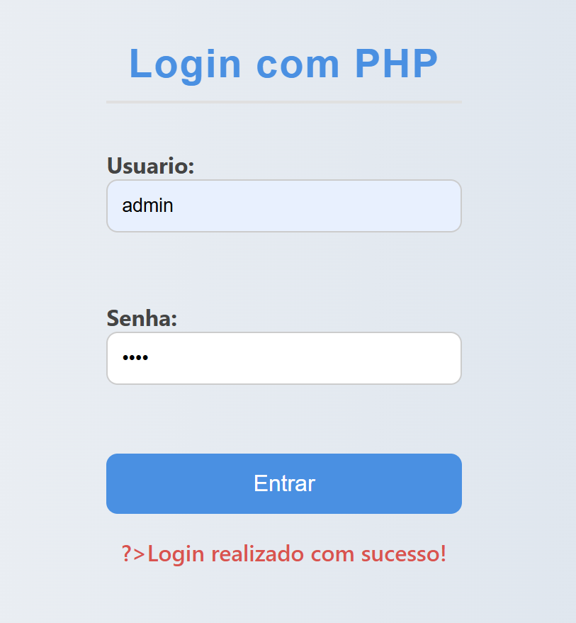

# Tela de Login com PHP + MySQL (Estudo rápido)

Esse projeto é uma tela de login simples, feita em **PHP com MySQL**, usando **HTML, CSS puro e JavaScript**. Foi desenvolvida com o objetivo de me familiarizar com PHP.  
Estou em processo de aprendizagem com a linguagem, mas com foco em aprendizado constante — e esse projetinho é parte desse caminho!

---
🖼️ ### Prints do projeto

✅ Tela de login (visual principal)

❌ Mensagem de erro (usuário ou senha inválido)

✅ Login realizado com sucesso

🛢️ Estrutura da tabela no banco de dados (phpMyAdmin)
##  Tecnologias usadas

- PHP (8.2)
- MySQL
- HTML5
- CSS3
- JavaScript (puro)
- VSCode
- XAMPP (para ambiente local)

---

##  Funcionalidades

- Tela de login simples e responsiva
- Conexão com banco de dados MySQL
- Verificação de usuário e senha com segurança básica (prepared statements)
- Feedback na tela usando JavaScript
- Estilo clean com CSS puro (sem framework)

---

## Estrutura do projeto

```

login_php/
├── db_config.php           // Conexão com o banco
├── verificar_login.php     // Verifica login no banco
├── login.html              // Tela de login
└── .env                    // (opcional) para guardar credenciais com mais segurança

```

---

## Como rodar localmente

1. Clone o repositório:
   ```bash
   git clone  https://github.com/peter-bueno/login-estudo-php.git
```

2. Coloque os arquivos em uma pasta dentro do `htdocs` (se estiver usando XAMPP)
   Ex: `C:/xampp/htdocs/login_php`

3. Crie um banco de dados chamado `login_php` com a tabela `usuario`:

   ```sql
   CREATE DATABASE login_php;
   USE login_php;

   CREATE TABLE usuario (
     id INT AUTO_INCREMENT PRIMARY KEY,
     nome VARCHAR(50) NOT NULL,
     senha VARCHAR(255) NOT NULL
   );

   INSERT INTO usuario (nome, senha) VALUES ('admin', 'admin');
   ```

4. Atualize as credenciais no arquivo `db_config.php`.

5. Rode o servidor PHP:

   ```bash
   php -S localhost:8000
   ```

6. Acesse no navegador:

   ```
   http://localhost:8000/login.html
   ```

---

##  Observações

* Esse projeto foi feito em pouco tempo e com foco didático.
* Ainda posso melhorar bastante coisas como uso de .env ou hash para senha, sessões e segurança geral.
* Mesmo assim, fiquei feliz por sair da zona de conforto e tentar algo novo!


---

###  Contato

Se quiser trocar uma ideia ou dar alguma dica, pode chamar:

* **Nome:** Peterson Bueno
* **Email:** \[pfbuenocontato@gmail.com]
* **LinkedIn:** \[www.linkedin.com/in/peterson-fbueno]

